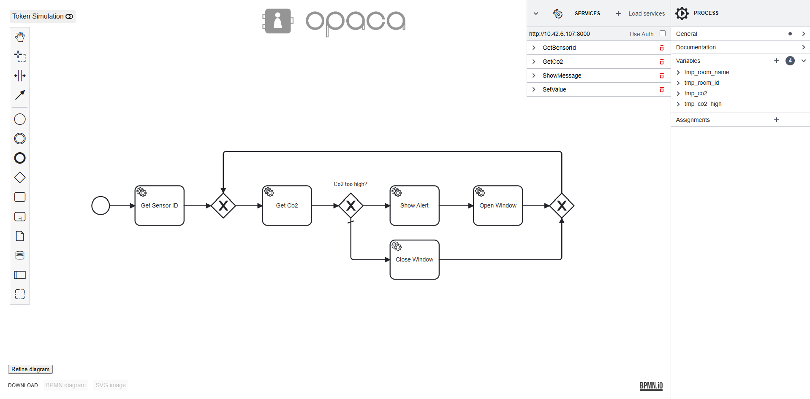

# BPMN JS Interpreter
Editing and interpreting business processes following the BPMN 2.0 standard.  

## Modeler
This editor is a node-style web application that builds a user interface around the [bpmn-js](https://github.com/bpmn-io/bpmn-js) BPMN 2.0 modeler.


### Properties Panel
It uses [bpmn-js](https://github.com/bpmn-io/bpmn-js) and [bpmn-js-properties-panel](https://github.com/bpmn-io/bpmn-js-properties-panel). It implements a BPMN 2.0 modeler that allows you to edit execution related properties via a properties panel.

### Extension of Properties Panel
Our extension follows the steps of [properties-panel-extension](https://github.com/bpmn-io/bpmn-js-examples/tree/main/properties-panel-extension) and [properties-panel-list-extension](https://github.com/bpmn-io/bpmn-js-examples/tree/main/properties-panel-list-extension) which show how to add custom properties(-lists) to the bpmn editor and the underlying bpmn diagram. With groups and nested groups we created the exact XML structure we wanted.

### Model
More about the bpmn model [here](./docs/model.md).

## Simulation
Also integrated in the editor is the [bpmn-js-token-simulation](https://github.com/bpmn-io/bpmn-js-token-simulation/tree/main), which is a great tool for visualization and learning. More about the simulation [here](./docs/simulation.md).

## Building (editor and integrated interpretation)
You need a [Node.js](http://nodejs.org) development stack with [npm](https://npmjs.org) installed to build the project.

To install all project dependencies execute (project root)

```sh
npm install
```

Build the example using [webpack](https://webpack.js.org/) via

```sh
npm run build
```

That generates the distribution ready client-side modeler application into the `public` folder.

Serve the application via

```sh
npm start
```

## Building (editor and Interpreter agent)
If you want to connect the interpreter to the OPACA runtime platform, you first need to create the server container acting as a mediator.

Build the Docker image (project root)

```sh
docker build -f ./companion-container/Dockerfile -t bpmn-interpreter-vsdt2-server .
```

Start the OPACA platform and open the UI following their [Quick Testing Guide](https://gitlab.dai-labor.de/jiacpp/prototype#getting-started-quick-testing-guide).

Go to `POST containers` and create the agent container by setting the `imageName` to `"bpmn-interpreter-vsdt2-server"`. Other fields can be removed.

Start the editor the same way you would with the integrated interpretation.

Go to `GET containers` or `GET agents` to see the server container and its actions.

Now you can invoke these actions in the `POST invoke` routes.
