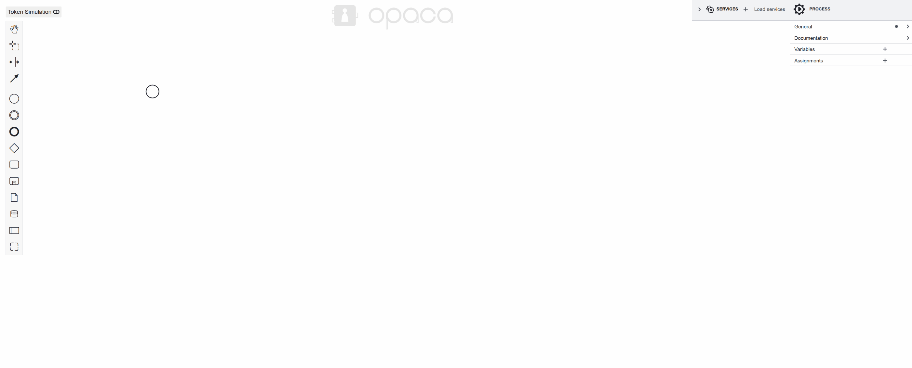
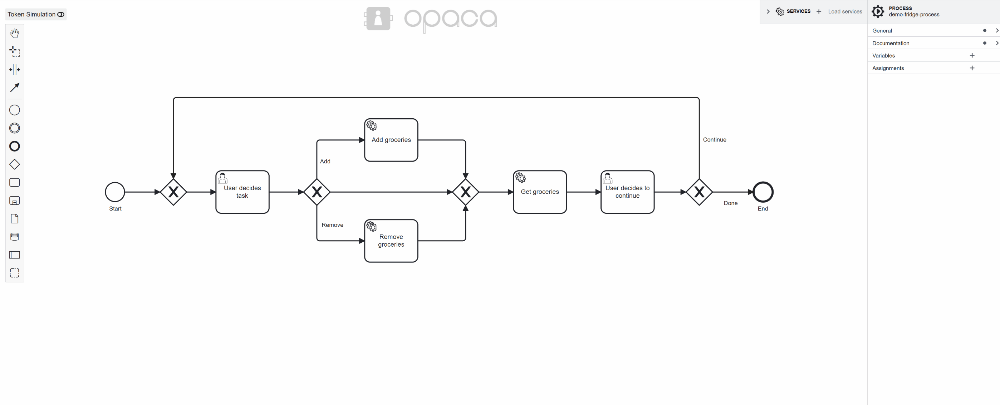
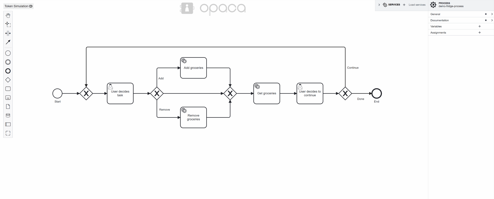
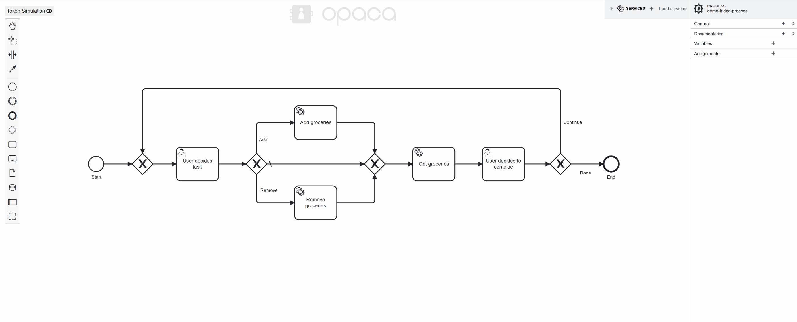

# User Manual
This is intended to provide an overview of the modeling and interpretation capabilities to new users.

## BPMN
**Business Process Model and Notation (BPMN)** is a graphical standard for modeling business processes. It provides a clear, standardized way to visualize workflows, making it easier for stakeholders to understand and improve business operations. BPMN uses various symbols, such as events, activities, and gateways, to represent different elements of a process.

For a very detailed explanation, check out: [BPMN Specification by OMG](https://www.bpmn.org/)

Or checkout [Camunda's Introduction](https://camunda.com/bpmn/) to BPMN.

## bpmn.io, bpmn-js
This editor is build on Camunda's bpmn-js editor. Creating a process is relatively simple. Just drag-and-drop elements from the element palette onto the canvas. If you want to learn more on how to model a process you can also check out other tutorials on the editor (A good starting point may be: [bpmn.io](https://bpmn.io/)).

## Extensions 
To make processes interpretable we introduced some custom properties you need to set when creating your process. The main properties being `Variables` (stored under processes and subprocesses) and `Assignments` (stored under events and activities).

## Setup
Our extensions and interpretation are build around the OPACA framework. The process we create in this tutorial will work with the OPACA platform and demo services running locally. These can also be found in the [OPACA examples/demo-services](https://github.com/GT-ARC/opaca-core/tree/main/examples/demo-services).
The setup of the platform and services is explained [here](https://github.com/GT-ARC/opaca-core/tree/main?tab=readme-ov-file#getting-started--quick-testing-guide).
We will create a process around a FridgeAgent, that can add, remove and get available groceries. 

## Modeling Process 
Let's walk through modeling a process that is ready for execution. 

#### 1. Importing services
First we import running services (in our case locally). For better overview we delete services we don't need.

#### 2. Diagram Structure
Next we can create the basic process structure. 

#### 3. Task Types and References
Then we change our Tasks to UserTasks and ServiceTasks. We reference imported Services in the serviceImplementation.
And we design the UserTask pop-up.

#### 4. Adding Variables and Assignments
In our case we only use Targets (UserTask) and Parameters (ServiceTask) as Variables. But you could also add extra Variables under a Process or SubProcess.
Targets get their Assignments from the user during execution. Other Assignments need to be defined during modeling. 
For Parameters, it is important to set the AssignTime to START, so they are made before being passed to the service.

#### 5. Adding Conditions
Now we need to add Conditions that set SequenceFlows.

#### 6. Mark as executable
When we are done, we can mark the process as executable. When this is not set, the standard token-simulation is used. You find a checkbox for it in the properties of the Process.

Now we have a process that evaluates conditions based on the variable values automatically. You can find the final demo-fridge-process XML in our [examples](../examples).
This is what the interpretation looks like:

## Special Properties
You can make your process more interesting with the inclusion of events. The editor supports following eventDefinitions:
- TimerEventDefinitions
- SignalEventDefinitions
- MessageEventDefinitions
- ConditionalEventDefinitions

## LLM Model Generation
You can also let an LLM handle your model creation. This is still not too refined, especially in terms of our custom properties. But it can be a good starting point for your business process. 
